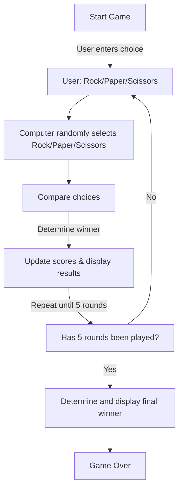

# Rock Paper Scissors

This is a simple Rock Paper Scissors game built using HTML, ~~CSS~~, and JavaScript as part of The Odin Project's JavaScript Foundation course.

## How to Play

1.  Click the "Start Game" button to begin.
    
2.  Enter your choice (Rock, Paper, or Scissors) in the prompt.
    
3.  The computer randomly selects Rock, Paper, or Scissors.
    
4.  The result of the round is displayed on the screen.
    
5.  The game continues for 5 rounds, and the overall winner is announced.
    
6.  Click "Start Over" to reset the game.
    

## Features

-   Interactive gameplay using `prompt()` for user input.
    
-   Randomized computer choice logic.
    
-   Score tracking and winner determination after 5 rounds.
    
-   Simple and clean UI for better user experience.
    
## Code Structure

### 1. **HTML**

-   Contains elements to display choices, scores, and round results.
    
-   Buttons for playing the next round and restarting the game.
    

### 2. **JavaScript**

#### Functions Breakdown:

-   `playRound()` - Handles a single round of the game.
    
    -   Prompts the user for input.
        
    -   Generates a random choice for the computer.
        
    -   Updates the UI based on the round outcome.
        
-   `generateComputerChoice()` - Randomly selects Rock, Paper, or Scissors for the computer.
    
-   `gameWinner()` - Determines the final winner after 5 rounds and disables further gameplay.
    
-   `restartGame()` - Resets scores, UI elements, and allows a new game to start

## Flowchart

## Technologies Used

-   HTML
-   JavaScript
- ~~CSS~~
    

## Future Improvements

-   Replace `prompt()` with buttons for better user interaction.
- Use proper looping and clean code once understand the concept
    
-   Add CSS styling for improved visual appeal.
    

## Acknowledgments

This project is part of [The Odin Project](https://www.theodinproject.com/).

## License

This project is open-source and free to use.